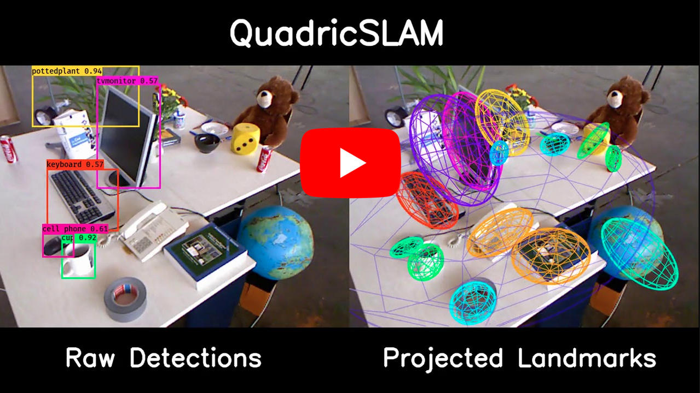

# GTSAM Quadrics: quadric landmarks for GTSAM #

<!-- badges -->
[](https://roboticvision.org/best-of-acrv)
[](./LICENSE.txt)

This repository contains an extension to the popular [GTSAM](https://github.com/borglab/gtsam) factor graph optimization library. We introduce constrained dual quadrics as GTSAM variables, and support the estimation of the quadric parameters using 2-D bounding box measurements. These tools are available for both c++ and Python and are designed to be used in conjunction with GTSAM. Also provided are a number of c++ and Python examples that demonstrate how quadric landmarks can be used in the SLAM context, alongside doxygen documentation and unit tests. 

<p align="center">


</p>

We expect this repository to be active and continually improved upon. If you have any feature requests or experience any bugs, don't hesitate to let us know. Our code is free to use, and licensed under BSD-3. We simply ask that you [cite our work](#citing-our-work) if you use QuadricSLAM in your own research. 

[](https://www.youtube.com/watch?v=n-j0DFDFSKU)


## Installation ## 

### Building and installation

After installing the required dependencies, build the core c++ gtsam_quadrics library:

```sh
# clone the repository 
$ git clone https://github.com/RoboticVisionOrg/gtsam_quadrics
$ cd gtsam_quadrics

# create build folder 
$ mkdir build
$ cd build

# (if you plan on using the python library)
$ cmake -DBUILD_PYTHON_WRAP=ON ..
# (otherwise, if you only want the gtsam_quadrics c++ library)
$ cmake -DBUILD_PYTHON_WRAP=OFF ..

# compile the library
$ make -j8

# optional: run the c++ unit tests
$ make check 

# optional: install the c++ and/or python library 
$ make install
```

The following table summarizes the available targets 
| **Command**    | **Description**                                |
| :---------     |   :-----------------------------------------   |
| make check     | compile and run optional unit tests            | 
| make examples  | compiles the c++ examples                      | 
| make doc       | generates the doxygen documentation            | 
| make doc_clean | removes the doxygen documentation              | 
| make install   | installs the gtsam_quadrics c++/python library | 

### Dependencies 

Base requirements:

* g++ compiler (`sudo apt-get install build-essential`)
* cmake >= 3.0 (`sudo apt-get install cmake`) 
* boost >= 1.43 (`sudo apt-get install libboost-all-dev`)
* metis (`sudo apt-get install libmetis-dev`) <!-- in future, automatically get from gtsam/3rdparty, required when including gtsam/Symbol.h etc, maybe we just need to update some path? -->
* [gtsam](https://github.com/borglab/gtsam) <= 4.0.3

Requirements to build gtsam_quadrics python module:

* gtsam <= 4.0.3: ensure the gtsam python library is built and on the python path
* cython: both `sudo apt-get install cython` and `pip3 install cython` required <!-- gtsam requisite --> <!-- maybe we can use one and update our CYTHON_PATH? --> <!-- gtsam only needs apt-get version -->
* python >= 3.0 <!-- gtsam requisite -->
* numpy <!-- gtsam requisite --> 

Optional requirements to build documentation:

* Doxygen (`sudo apt-get install doxygen`)
* epstopdf (`sudo apt-get install textlive-font-utils`)


### Notes on installation
**You may find gtsam does not install gtsam.pxd automatically:** in this case, add the gtsam build/cython folder to your $PYTHONPATH with the following `export PYTHONPATH=$PYTHONPATH:/path/to/gtsam/build/cython`

**If using GTSAM 4.0.3 or exponential-map rotations:** gtsam 4.0.3 moved to exponential map by default to parametrize rotations. The analytical derivatives we've calculated from this library are based on the cayley transform. Please either select cayley rotations in the gtsam CMakelists or use numerical derivatives (defined in boundingboxfactor.cpp).

**If you plan to use gtsam_quadrics in c++:** You can find the installed C++ headers using the cmake command `find_package(GTSAM_QUADRICS REQUIRED)` which will load `GTSAM_QUADRICS_INCLUDE_DIR`. The default header installation is `/usr/local/include/gtsam_quadrics/`, and by default library is installed to `/usr/local/lib/libgtsam_quadrics.so`. 

**If you plan to use gtsam_quadrics in python:** ensure you have build location (`/build/cython/gtsam_quadrics`) or the install location (default: `/usr/local/cython/gtsam_quadrics`) on your PYTHONPATH. If you plan to make changes to the gtsam_quadrics source code, I advise adding the build location instead to avoid having to install every time you recompile the library. Assuming you have followed the instructions above, we can automatically source the installed gtsam_quadrics library by explicitly adding the following line to your ~/.bashrc file. 

```sh
# add gtsam_quadrics to PYTHONPATH
export PYTHONPATH=$PYTHONPATH:/usr/local/cython/gtsam_quadrics
```

<!-- ## Using QuadricSLAM

This library can be used to incorperate quadric landmarks into existing SLAM systems, or -->

<!-- Three types of users. 1. builds their own system from gtsam_quadrics -->
<!-- Three types of users. 2. modifies our scripts to add their own methods -->
<!-- Three types of users. 3. uses our scripts -->

## Basic Usage 

```python
import gtsam
import gtsam_quadrics

# setup constants
pose_key = int(gtsam.symbol(ord('x'), 0))
quadric_key = int(gtsam.symbol(ord('q'), 5))

# create calibration
calibration = gtsam.Cal3_S2(525.0, 525.0, 0.0, 160.0, 120.0)

# create graph/values
graph = gtsam.NonlinearFactorGraph()
values = gtsam.Values()

# create noise model (SD=10)
bbox_noise = gtsam.noiseModel_Diagonal.Sigmas(np.array([10]*4, dtype=np.float))

# create quadric landmark (pose=eye(4), radii=[1,2,3])
initial_quadric = gtsam_quadrics.ConstrainedDualQuadric(gtsam.Pose3(), np.array([1.,2.,3.]))

# create bounding-box measurement (xmin,ymin,xmax,ymax)
bounds = gtsam_quadrics.AlignedBox2(15,12,25,50)

# create bounding-box factor
bbf = gtsam_quadrics.BoundingBoxFactor(bounds, calibration, pose_key, quadric_key, bbox_noise)

# add landmark to values
initial_quadric.addToValues(values, quadric_key)

# add bbf to graph
graph.add(bbf)


# get quadric estimate from values (assuming the values have changed)
quadric_estimate = gtsam_quadrics.ConstrainedDualQuadric.getFromValues(values, object_key)
```


## Planned developments
* High-level SLAM front-end (akin to ORBSLAM2)
* Support for GTSAM 4.1.0, pybind and expmap/logmap
* Tools to visualize and evaluate quadric landmarks

## Notes ##

### Adding Quadrics to gtsam::Values ###
When using the python interface, ConstrainedDualQuadrics can be added or retrieved from Values using the following. Since GTSAM 4.0 the python interface for Values manually specializes each type. When supported by GTSAM, we plan to derive the gtsam::Values class and add the insert/at methods for ConstrainedDualQuadric. 

```Python
quadric.addToValues(values, key)
quadric = gtsam_quadrics.ConstrainedDualQuadric.getFromValues(values, key)
```


## Common Issues ##

```
cython/gtsam_quadrics/gtsam_quadrics.pxd:1:0: 'gtsam/gtsam.pxd' not found
```

If you attempt to build gtsam_quadrics and receive the above error, ensure that gtsam is installed with the cython toolbox enabled, and that it is on the PYTHONPATH. Some versions of GTSAM do not seem to install this file, in which case you will need to add the gtsam/build/cython folder to your PYTHONPATH manually, i.e `export PYTHONPATH=$PYTHONPATH:/path/to/gtsam/build/cython`. 


```
AttributeError: module 'gtsam_quadrics' has no attribute 'ConstrainedDualQuadric'
```

If you import gtsam_quadrics and find it does not contain any attributes, or receive the above, ensure that gtsam_quadrics is built with BUILD_PYTHON_WRAP set ON, the correct python version is used, and that the generated gtsam_quadrics.so shared library is on your PYTHONPATH. I.e, if you have installed gtsam_quadrics, that you have the following line in your ~/.bashrc

```
export PYTHONPATH=$PYTHONPATH:/usr/local/cython/gtsam_quadrics
```

## Citing our work ##
If you are using this library in academic work, please cite the [publication](https://ieeexplore.ieee.org/document/8440105):

L. Nicholson, M. Milford and N. Sünderhauf, "QuadricSLAM: Dual Quadrics From Object Detections as Landmarks in Object-Oriented SLAM," in IEEE Robotics and Automation Letters, vol. 4, no. 1, pp. 1-8, Jan. 2019, doi: 10.1109/LRA.2018.2866205. [PDF](https://arxiv.org/abs/1804.04011).

```bibtex
@article{nicholson2019,
  title={QuadricSLAM: Dual Quadrics From Object Detections as Landmarks in Object-Oriented SLAM},
  author={Nicholson, Lachlan and Milford, Michael and Sünderhauf, Niko},
  journal={IEEE Robotics and Automation Letters},
  year={2019},
}
```
